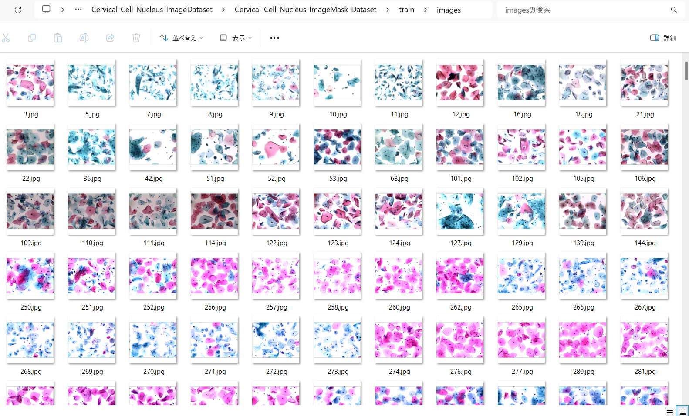

<h2>Cervical-Cell-Nucleus-Image-Dataset (2024/02/02)</h2>
The dataset used here has been take from the following <b>mendeley.com</b> website

<a href="https://data.mendeley.com/datasets/jks43dkjj7/1">Data for: Binary Tree-like Network with Two-path Fusion Attention Feature for Cervical Cell Nucleus Segmentation
</a>

<h3>1. Dataset Citation</h3>

<b>Data for: Binary Tree-like Network with Two-path Fusion Attention Feature for Cervical Cell Nucleus Segmentation</b>
<pre>
Published: 18 April 2019 Version 1

https://data.mendeley.com/datasets/jks43dkjj7/1

DOI:
10.17632/jks43dkjj7.1

Contributor:
Jianwei Zhang

Description
The images are based on Liquid-Based Cytology test from the pathology departments of a Chinese hospital 
and a biomedical device company. Under the guidance of a professional pathologist, we choose qualified 
images in numerous LCT cervical images. The dataset contains 104 images with size  and each image has 
a ground truth that has been manually segmented by a professional pathologist.

Licence
CC BY 4.0
</pre>

<h3>
2. Download master dataset
</h3>

Please donwload master dataset from the following <b>mendeley.com</b> website

<a href="https://data.mendeley.com/datasets/jks43dkjj7/1">Data for: Binary Tree-like Network with Two-path Fusion Attention Feature for Cervical Cell Nucleus Segmentation
</a>

The dataset has the following folder structure. 
<pre>
./dataset_forsubmit
├─GroundTruth
├─groundtruth_mask
└─imgbmp
</pre>
GrounsTruth and imgbmp folders contains 104 bmp files respectively 

<h3>
3. Create ImageMask Dataset
</h3>
<h3>
3.1 Create base dataset
</h3>
Please run Python script <a href="./generator/ImageMaskDatasetGenerator.py">ImageMaskDatasetGenerator.py</a>.
to create jpg image and mask files. 
<pre>
>python create_base_dataset_512x512.py
</pre>
This script performs the following image processings. 
<pre>
1 Create 512x512 square masks from the original img files in <b>imgbmp</b> folder. 

2 Create 512x512 square images corresponding to the image files from the original bmp files 
in <b>GroundTruth</b> folder
</pre>
The created <b>Cervical_Cell_Nucleus_Master</b> dataset has the following folder structure. 

<pre>
./Cervical_Cell_Nucleus_Master
 ├─images
 └─masks
</pre>

<h3>
3.2 Split master dataset to test, train and valid 
</h3>
By using Python script <a href="./generator/split_master.py">split_master.py</a>,
 we have finally created <b>Cervical-Cell-Nucleus-ImageMask-Dataset</b> dataset from the <b>Cervical_Cell_Nucleus_Master</b>. 
<pre>
./Cervical-Cell-Nucleus-ImageMask-Dataset
├─test
│  ├─images
│  └─masks
├─train
│  ├─images
│  └─masks
└─valid
    ├─images
    └─masks
</pre>

<b>train/images samples:</b> 

 
<b>train/masks samples:</b> 

 
 

 

You can download this dataset from the google drive 
<a href="https://drive.google.com/file/d/1hyxctv-trt36A72YXHGklo5GEUZOf0jR/view?usp=sharing">
Cervical-Cell-Nucleus-ImageMask-Dataset.zip</a>

